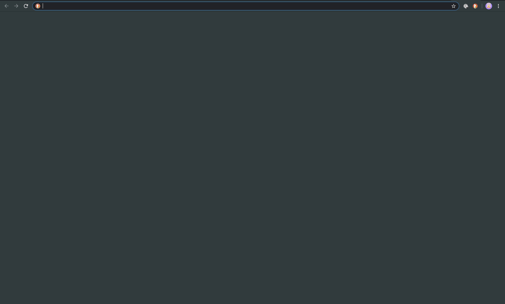

### Index
- [About My Mac](#about-my-mac)
  * [Homebrew](#homebrew)
  * [Font & Color Scheme](#font--color-scheme)
- [Application: Productivity](#application-productivity)
  * [Alfred 🕺](#alfred-)
  * [Better Touch Tool 👯‍♂️](#better-touch-tool-%EF%B8%8F)
  * [Contexts 👯](#contexts-)
  * [Things 3 😟](#things-3-)
- [Application: Utility](#application-utility)
  * [Chrome](#chrome)
  * [1Passowrd](#1passowrd)
  * [Spark](#spark)
  * [Amphetamine](#amphetamine)
  * [Dozer](#dozer)
  * [Spotify & Boom 3D & BeardedSpice](#spotify--boom-3d--beardedspice)
  * [iMazing](#imazing)
- [Application: Develop](#application-develop)
  * [iTerm2](#iterm2)
  * [Sublime Text 3](#sublime-text-3)
  * [IDEA](#idea)
  * [Paw](#paw)
- [System Preferences](#system-preferences)
- [Terminal Tweaks](#terminal-tweaks)

# About My Mac
## Homebrew

This is **'Super Awwwwwwwwesome'** [package manager](https://docs.brew.sh/Installation).  
If you are use this tool, you can save your time.

## Font & Color Scheme

**Font**  
There are many fonts in this world, but I prefer '[Hack Nerd]((https://github.com/ryanoasis/nerd-fonts))' font.

**Color Scheme**  
I prefer `gruvbox` color scheme. You can see color scheme [here](https://github.com/morhetz/gruvbox) 
and use [contribution](https://github.com/morhetz/gruvbox-contrib).

[Go to Top](#index)

---
# Application: Productivity

## Alfred 🕺

This is **awesome launcher app**, [Alfred 3](https://www.alfredapp.com/).  
It has more feature than Spotlight.  
* can search anything in my mac.
* can search something in web without fousing web browser.
* can store/get in clipboard, text, image, and file.
* can convert text using snippet.
* can explore your mac more and more using Workflow.

**Theme**  
I revised color and font for [appearence](./gruvbox_dark.alfredappearance) based on **gruvbox**.  
!! You must should install **'Hack Nerd'** [font](#font--color-scheme) if you use this appearence.  


Settings in iCloud: `iCloud/application/alferd/` 

### Workflows
Alfred say ...
> With Alfred's Powerpack and workflows, ... and boost your productivity.

However, there are so many workflows and some of them will be not updated.  
Workflows is good to me but sometimes it is hard to find nice workflows.  

I searched in goolge and github, and I make a note to keep workflows.  
If you want to see [more](../../../alfred-workflow)...

## Better Touch Tool 👯‍♂️

All inputs through mac can customized as you want if you have **Better Touch Tool**.  

I have a another keyboard, but sometimes I have to use keyboard of this mac.  
When I push <kbd>fn</kbd>, I can press function key. But it is awkward to press function key in IDEA.  
So I just mapped number key to function using [Better Touch Tool](https://folivora.ai/).

## Contexts 👯 

Contexts manages all windows and application in my mac.  
When you want to switch between application, you press <kbd>command</kbd> + <kbd>tab</kbd>.  
Or when you want to switch windows between in a application, you press <kbd>command</kbd> + <kbd>\`</kbd>.  
But if you have more windows as a full screen, the switching is not working as you want. 

[Contexts](https://contexts.co/) enable to **switch windows as I want**.  
Just try to use this app.

## Things 3 😟

Have you heard *GTD*? 
> 'Getting Things Done' is a time management method, ...  
>  from wikipedia

When you are focusing on something, there are times when an idea suddenly comes to mind.  
You do not have to worry about missing that idea anymore.

1. Just put in idea, [Things](https://culturedcode.com/things/).
2. Get it from Things when you want.
3. Do it.

# Application: Utility

## Chrome

This is **Web Brower**, it has more extension.  
Specially, I use 1Password extension to fill login information. 

**Camo Theme**: This is simple and modern [theme](https://chrome.google.com/webstore/detail/camo/mlkdlonndpcdkfdinngnoiddngiagiph).  


## 1Passowrd

If you stil rememeber you **password**, **license**, and **some secret thing**   
or write them to note app/a piece of papepr,  
You can write them into [1Password](https://1password.com/) and get them when/what you want.

This app also supports IOS, web, and Andorid.

## Spark

Email clients, That's all.

## Amphetamine

[Amphetamine](https://apps.apple.com/kr/app/amphetamine/id937984704?mt=12) **keeps awake mac**.  
I know there are many app and workflows.  
But this is simple and good to me.

## Dozer

You know [Bartender3](https://www.macbartender.com/). Dozer can **hides status icon** too.  
There are two points and you just drag it to hide icon.

Dozer is in [here](https://github.com/Mortennn/Dozer).

## Spotify & Boom 3D & BeardedSpice

**Spotify** is music player, **Boom 3d** is for equalizing, and **BeardedSpice** is to control player in global.

## iMazing

If you want to **transfer file to your iPhone**,  
And if you want to **make back-up for iPhone**,  
And if you are still using iTunes,  

You can use [iMazing](https://imazing.com/)(or [Waltr](https://softorino.com/waltr/)).

# Application: Develop

## iTerm2

This is **Terminal app**, [iTerm2](https://iterm2.com/downloads.html).  
This is well-known terminal app. You can customize it and set status for mac.  
And the **Theme**, 
I set color scheme as **gruvbox**. I referred this [contribution](https://github.com/martinlindhe/base16-iterm2/tree/master/itermcolors).  

Setting in iCloud: `iCloud/application/iterm/`

### zsh
`zsh` is alternative to bash. Actuall I installed `fish` but It is akward to me.
So I prefer [zsh](https://github.com/ohmyzsh/ohmyzsh/wiki/Installing-ZSH).  
Just do it if you have Homebrew.

```shell
  brew install zsh
```
* [Oh My zsh!](https://github.com/ohmyzsh/ohmyzsh): Plugin manager for `zsh`.
* [Powerlevel10k](https://github.com/romkatv/powerlevel10k): Make it more fast.

#### Command Line Tools
* [bat](https://github.com/sharkdp/bat): Alternative to `cat`.
* [fd](https://github.com/sharkdp/fd): Alternative to `find`.
* [ripgrep](https://github.com/BurntSushi/ripgrep): Alternative to `grep`.
* [exa](https://github.com/ogham/exa): Alternaive to `ls`.
  ```shell
    alias l="exa --long --header --icons --sort=modified --reverse"
  ```
* [jenv](https://github.com/jenv/jenv#1-getting-started): Java Version Manager.
* [pyenv](https://github.com/pyenv/pyenv#homebrew-on-macos): Python Version Manager.
* [virtualenv](https://github.com/pyenv/pyenv-virtualenv): Virtual Environment for Python.
* [nvm](https://github.com/nvm-sh/nvm): Node Version Manger.

## Sublime Text 3
This is **Text Editor**, it is simple and fast.
I use two editor to write somethig, Notion and [Sublime Text](https://www.sublimetext.com/3).  
Notion has unlimited feature and is pretty good.  
But Notion is not fast as much as I expect.  

Sublime Text is fast and simple so I prefer to write something temporary.  
And I am editing this documents using Sublime Text.

### Preference
<details>
  <summary>Expand...</summary>

```json
{
 "font_face": "Hack Nerd Font",
 "font_size": 18,
 "tab_size": 2,
 "remember_full_screen": true,
 "line_numbers": false,
 "fade_fold_buttons": false,
 "mini_diff": "auto",
 "translate_tabs_to_spaces": true,
 "indent_to_bracket": true,
 "highlight_line": true,
 "line_padding_top": 2,
 "line_padding_bottom": 2,
 "scroll_speed": 2.0,
 "highlight_modified_tabs": true,
 "show_tab_close_buttons": false,
 "bold_folder_labels": true,
}
```
</details>

And the **Theme**, 
I set color scheme as **gruvbox**. I referred this [contribution](https://github.com/Briles/gruvbox).  
<details>
  <summary>Expand...</summary>

```json
{
  "theme": "gruvbox.sublime-theme",
  "color_scheme": "Packages/gruvbox/gruvbox (Dark) (Medium).sublime-color-scheme",
  "gruvbox_buttons_font_size_16": true,
  "gruvbox_command_palette_compact": true,
  "gruvbox_folder_icons_large": true,
  "gruvbox_folder_icons_square": true,
  "gruvbox_iconset_midstroke": true,
  "gruvbox_panel_xxs": true,
  "gruvbox_scrollbar_width_xl": true,
  "gruvbox_scrollbar_width_xs": true,
  "gruvbox_sidebar_cozy": true,
  "gruvbox_sidebar_font_size_10": true,
  "gruvbox_sidebar_heading_bold": true,
  "gruvbox_sidebar_indent_xxs": true,
  "gruvbox_sidebar_label_bold": true,
  "gruvbox_statusbar_button_xxs": true,
  "gruvbox_statusbar_font_size_16": true,
  "gruvbox_statusbar_xxs": true,
  "gruvbox_tabs_font_size_14": true,
  "gruvbox_tabs_xxs": true,
}
```
</details>

### Package
* [Markdown Preview](https://packagecontrol.io/packages/MarkdownPreview): Preview for markdwon.
* [LiveReload for Sublime Text 3](https://packagecontrol.io/packages/LiveReload): Not need to refresh anymore.
* Kotlin: Highlight Kotlin.

### Terminal to Sublime Text 3
Add to this alias to `~/.zshrc`.
```shell
  alias open-here="open -a /Applications/Sublime\ Text.app \`pwd\`"
  alias open-there="open -a /Applications/Sublime\ Text.app \`pbpaste\`"
```

## IDEA

[Intellij](./application/intellij/README.md) has **integration tool to develop** something.  
And you can customize it.

**Theme**  
[Grovbox theme](https://plugins.jetbrains.com/plugin/12310-gruvbox-theme)

## Paw

I know Postman is famous and free.  
But I purchased liscense this [Paw](https://paw.cloud/).

[Go to Top](#index)

---  
# System Preferences
There are just screenshots to set 'System Preferences'.  
If you want to see [more](system_preferences/README.md) ...  
[Go to Top](#index)

---  
# Terminal Tweaks
<details>
  <summary>Quick Look: Animation</summary>

**Apply**  
```shell
defaults write -g QLPanelAnimationDuration -float 0; killall Finder
```
**Reset**
```shell
defaults delete -g QLPanelAnimationDuration; killall Finder
```
</details>

<details>
  <summary>Dock: Delay</summary>

**Apply**
```shell
defaults write com.apple.Dock autohide-delay -float 0; killall Dock
```
**Reset**
```shell
defaults delete com.apple.dock autohide-delay; killall Dock
```
</details>

<details>
  <summary>Dock: Animation</summary>

**Apply**
```shell
defaults write com.apple.dock autohide-time-modifier -float 0; killall Dock
```
**Reset**
```shell
defaults delete com.apple.dock autohide-time-modifier; killall Dock
```
</details>

<details>
  <summary>Launch Pad: Animation</summary>

**Apply**
```shell
defaults write com.apple.dock springboard-show-duration -int 0; killall Dock
```
```shell
defaults write com.apple.dock springboard-hide-duration -int 0; killall Dock
```
**Reset**
```shell
defaults delete com.apple.dock springboard-show-duration; killall Dock
```
```shell
defaults delete com.apple.dock springboard-hide-duration; killall Dock
```
</details>

<details>
  <summary>Pop-up&Dialog: Animation</summary>

**Apply**
```shell
defaults write -g NSWindowResizeTime -float 0.01
```
```shell
defaults write -g NSAutomaticWindowAnimationsEnabled -bool FALSE
```
**Reset**
```shell
defaults delete -g NSWindowResizeTime
```
```shell
defaults delete -g NSAutomaticWindowAnimationsEnabled
```
</details>

<details>
  <summary>Screenshot</summary>

**File Format**  
Default: .png
```shell
defaults write com.apple.screencapture type PDF; killall SystemUIServer
```
**File Path**  
Default: ~/Desktop
```shell
defaults write com.apple.screencapture location /drag/location/here; killall SystemUIServer
```
</details>

[Go to Top](#index)  