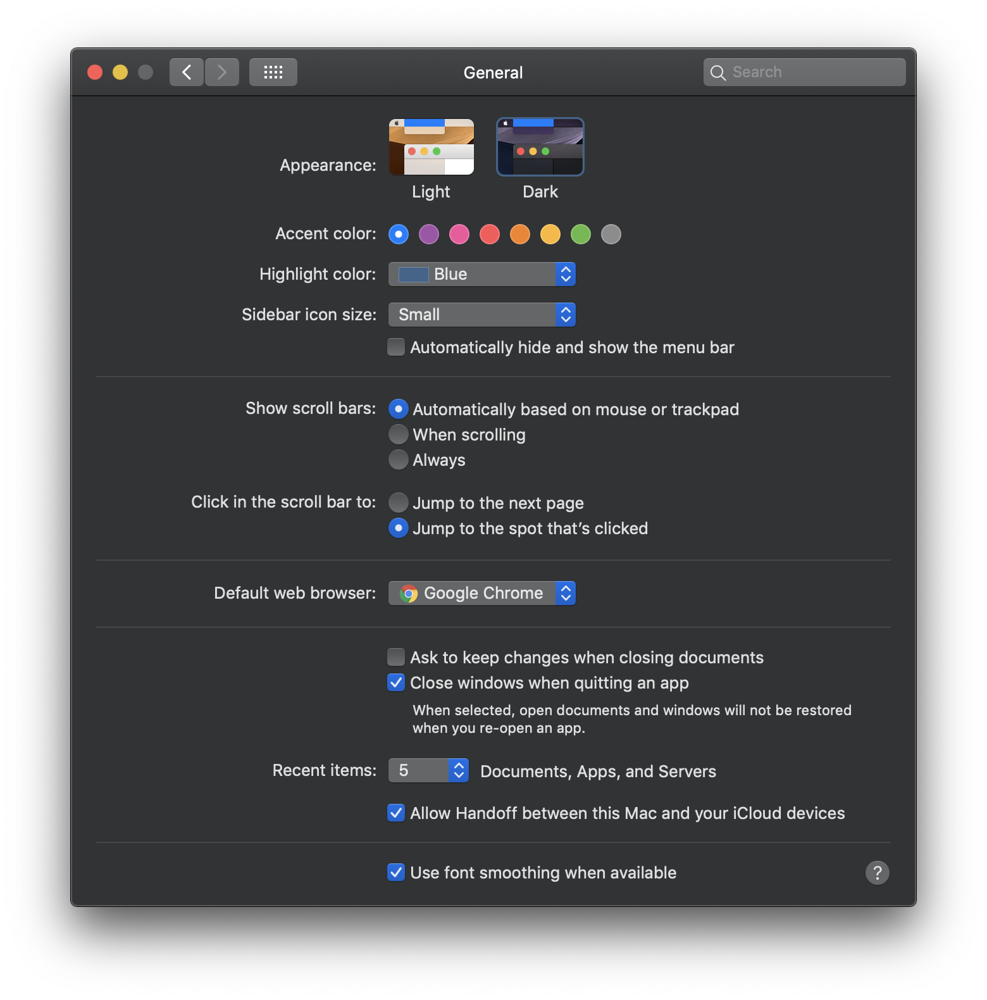
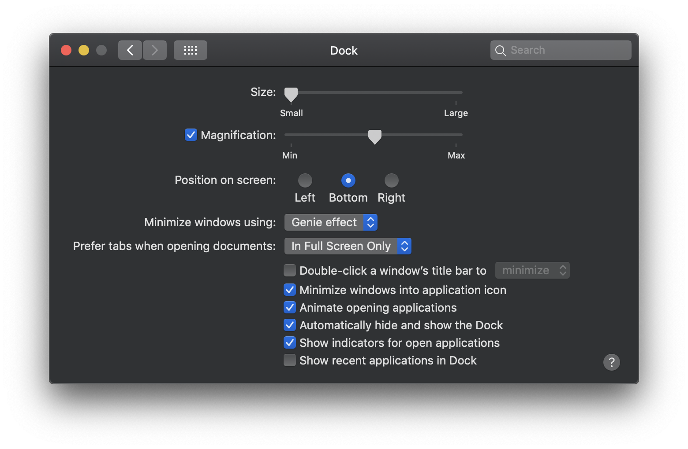
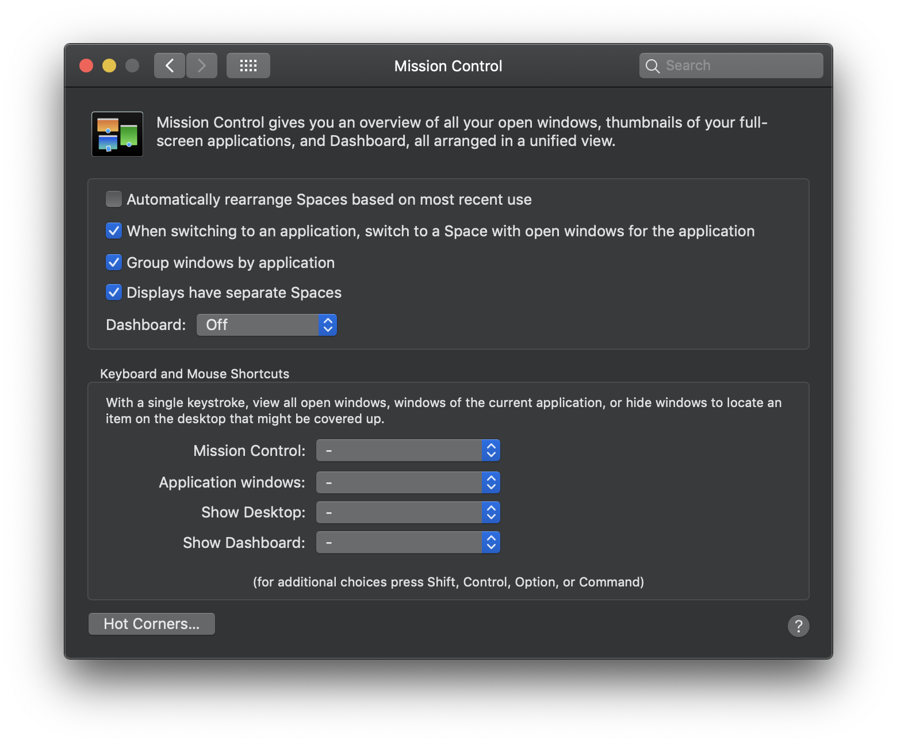
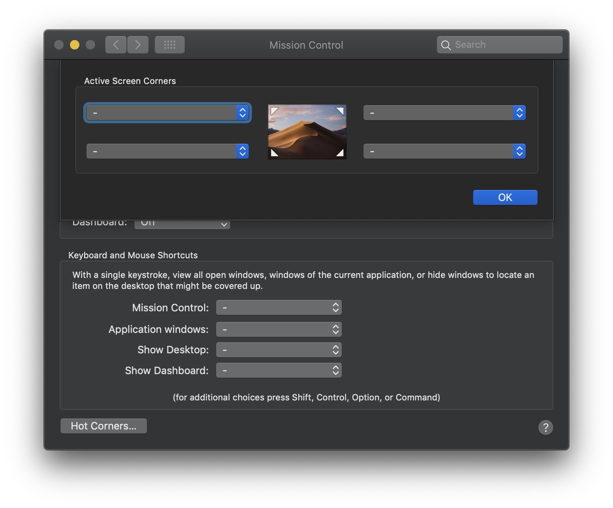

# System Preferences
  * [General](#general)
  * [Dock](#dock)
  * [Mission Control](#mission-control)
## General
[Go to Top](#system-preferences)

## Dock
[Go to Top](#system-preferences)

## Mission Control
[Go to Top](#system-preferences)

